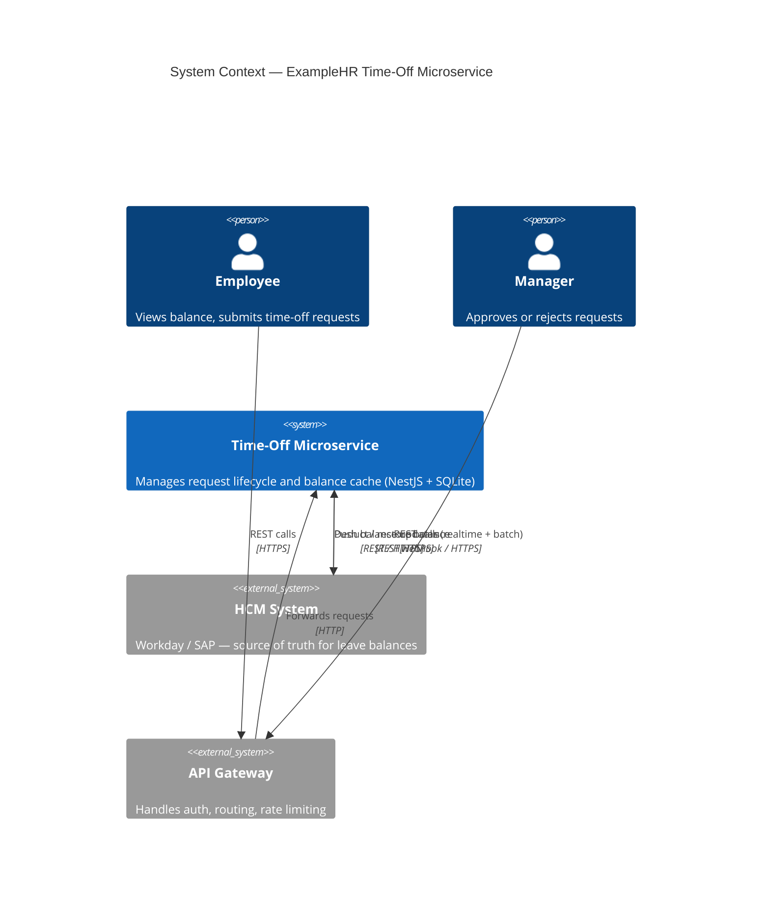
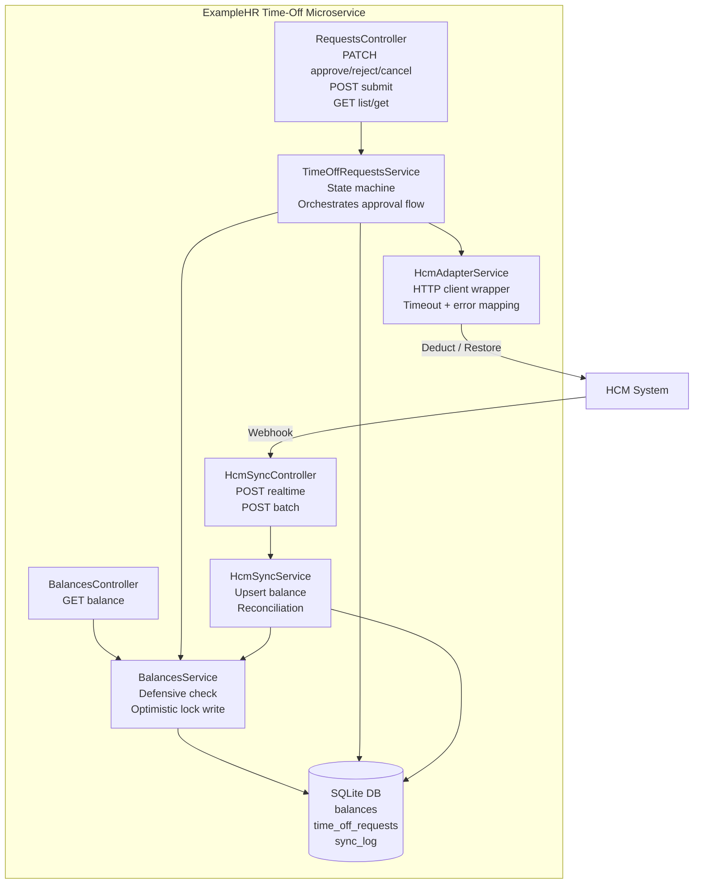
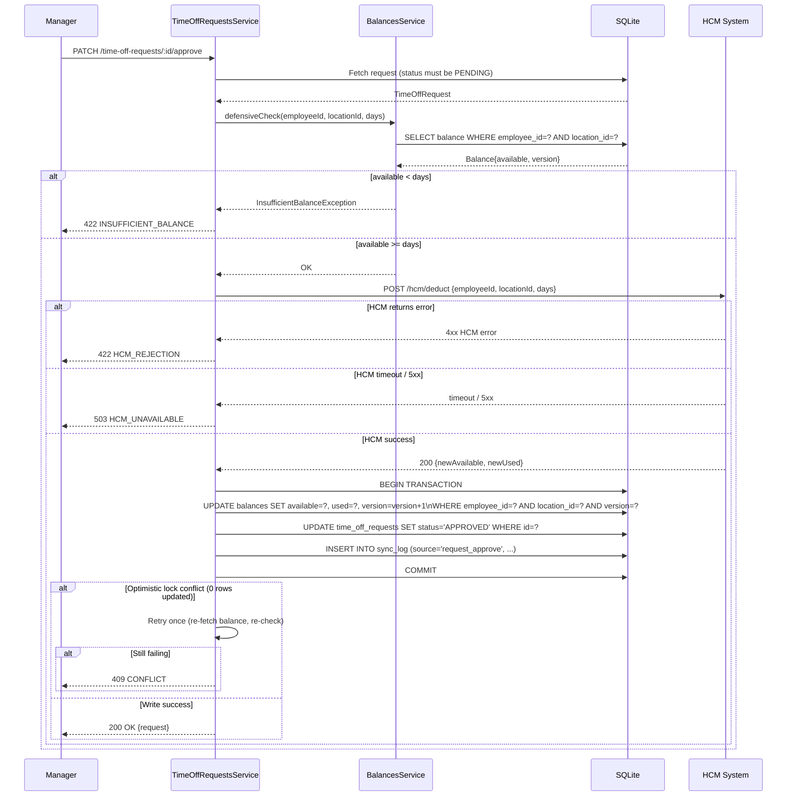
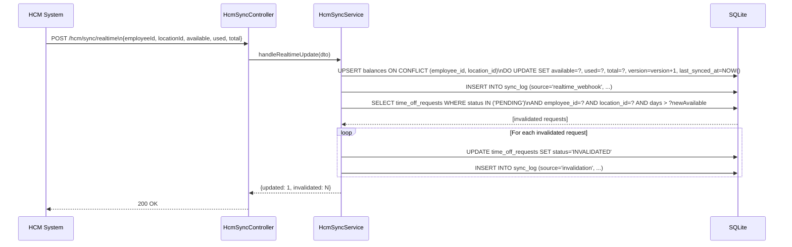
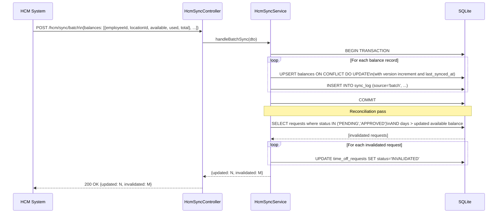
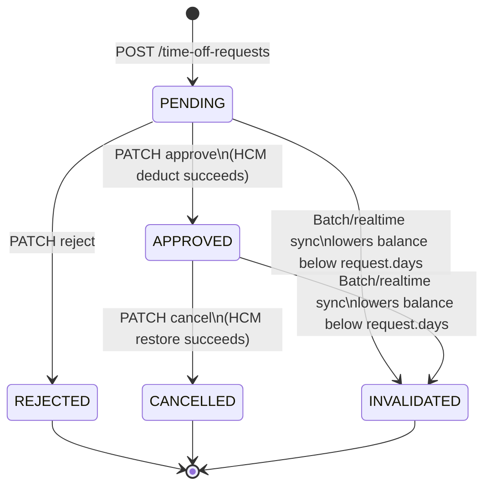
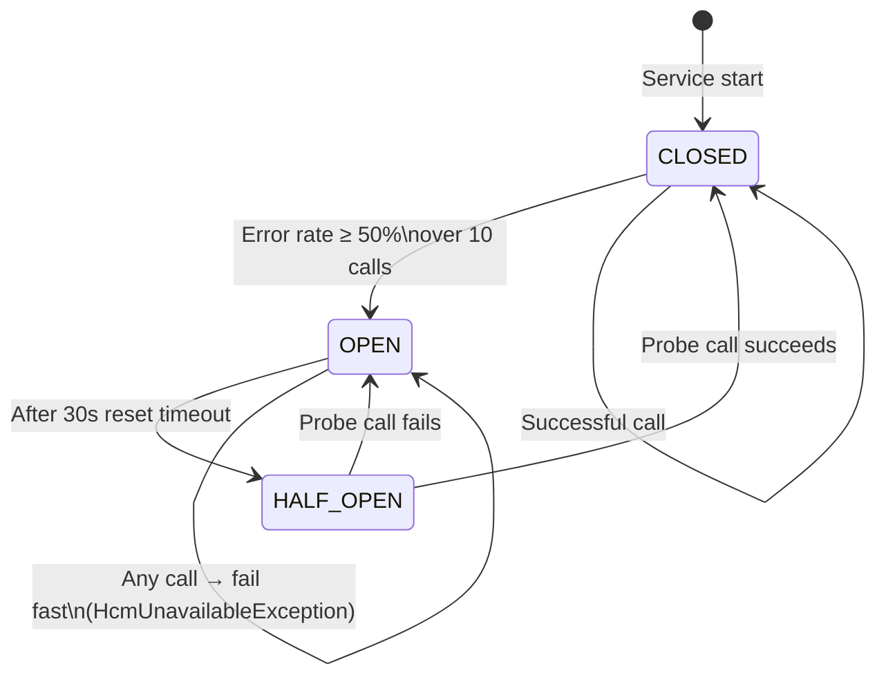
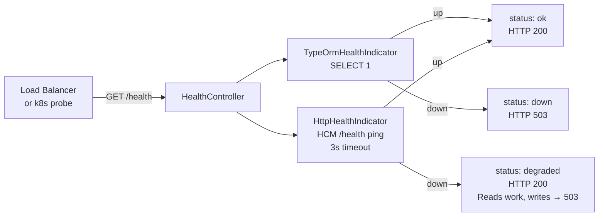
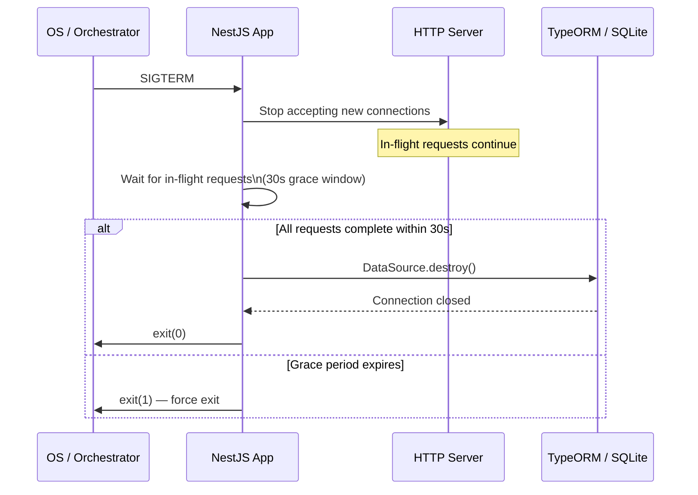

# Architecture Diagrams

---

## 1. System Context

---

## 2. Component Diagram

---

## 3. Request Approval Sequence

---

## 4. HCM Real-Time Webhook Flow

---

## 5. HCM Batch Sync Flow

---

## 6. Request Status State Machine

---

## 7. Circuit Breaker State Machine (HcmAdapterService)

---

## 8. Health Check Component

---

## 9. Graceful Shutdown Sequence

