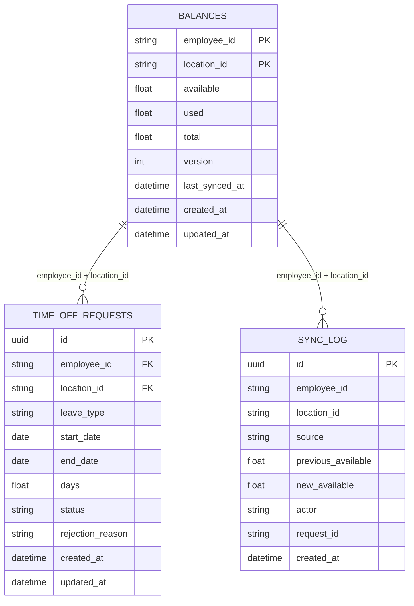

# Data Model

---

## Entity-Relationship Diagram

---

## Table Descriptions

### `balances`

The local cache of HCM leave balances. Keyed by `(employee_id, location_id)`.

| Column | Type | Notes |
|--------|------|-------|
| `employee_id` | VARCHAR | Composite PK. HCM-issued employee identifier. |
| `location_id` | VARCHAR | Composite PK. HCM-issued location identifier. |
| `available` | FLOAT | Days available to be requested. |
| `used` | FLOAT | Days already consumed (approved + not cancelled). |
| `total` | FLOAT | Total entitlement (`available + used` at any point in time). |
| `version` | INTEGER | Optimistic lock counter. Incremented on every write. |
| `last_synced_at` | DATETIME | Timestamp of the last inbound sync event (realtime or batch). |
| `created_at` | DATETIME | Row creation timestamp. |
| `updated_at` | DATETIME | Row last-updated timestamp. |

**Key constraint:** `version` is used in all UPDATE statements as `WHERE version = :expected`. If 0 rows are affected, a `ConflictException` is thrown.

**Uniqueness:** `UNIQUE(employee_id, location_id)` — composite primary key.

---

### `time_off_requests`

The lifecycle record for a single time-off request.

| Column | Type | Notes |
|--------|------|-------|
| `id` | UUID | Primary key. Generated at creation. |
| `employee_id` | VARCHAR | FK-like reference to `balances.employee_id`. |
| `location_id` | VARCHAR | FK-like reference to `balances.location_id`. |
| `leave_type` | VARCHAR | E.g., `VACATION`, `SICK`, `PERSONAL`. Value validated by HCM at approval time. |
| `start_date` | DATE | Inclusive start of requested leave. |
| `end_date` | DATE | Inclusive end of requested leave. |
| `days` | FLOAT | Requested duration in days (may include half-days). |
| `status` | ENUM | `PENDING` \| `APPROVED` \| `REJECTED` \| `CANCELLED` \| `INVALIDATED` |
| `rejection_reason` | VARCHAR | Optional. Set when status is `REJECTED`. |
| `created_at` | DATETIME | Row creation timestamp. |
| `updated_at` | DATETIME | Row last-updated timestamp. |

**Status transitions:** See `ARCHITECTURE.md` state machine diagram.

**Overlap check:** Before inserting, query for any `PENDING` or `APPROVED` requests for the same `(employee_id, location_id)` that overlap the `(start_date, end_date)` range. Overlapping requests return `409 CONFLICT`.

---

### `sync_log`

Append-only audit trail of every balance change. Never updated or deleted.

| Column | Type | Notes |
|--------|------|-------|
| `id` | UUID | Primary key. |
| `employee_id` | VARCHAR | Employee whose balance changed. |
| `location_id` | VARCHAR | Location of the balance that changed. |
| `source` | ENUM | `realtime_webhook` \| `batch` \| `request_approve` \| `request_cancel` \| `invalidation` |
| `previous_available` | FLOAT | Balance before the change. |
| `new_available` | FLOAT | Balance after the change. |
| `actor` | VARCHAR | System component or user ID that triggered the change. |
| `request_id` | UUID | If change is tied to a specific request, its ID. NULL for sync events. |
| `created_at` | DATETIME | Timestamp of the log entry. |

---

## SQLite-Specific Notes

- **Composite primary key** on `balances`: SQLite supports this natively.
- **Optimistic locking**: Implemented at the application layer; SQLite does not natively support `SELECT ... FOR UPDATE`.
- **UUIDs**: Generated in application code (`crypto.randomUUID()`); stored as TEXT in SQLite.
- **ENUM columns**: Stored as VARCHAR with application-level validation via TypeORM enum decorators.
- **Indexes:**
  - `time_off_requests(employee_id, location_id, status)` — for reconciliation queries.
  - `time_off_requests(start_date, end_date)` — for overlap detection.
  - `sync_log(employee_id, location_id, created_at)` — for audit queries.
